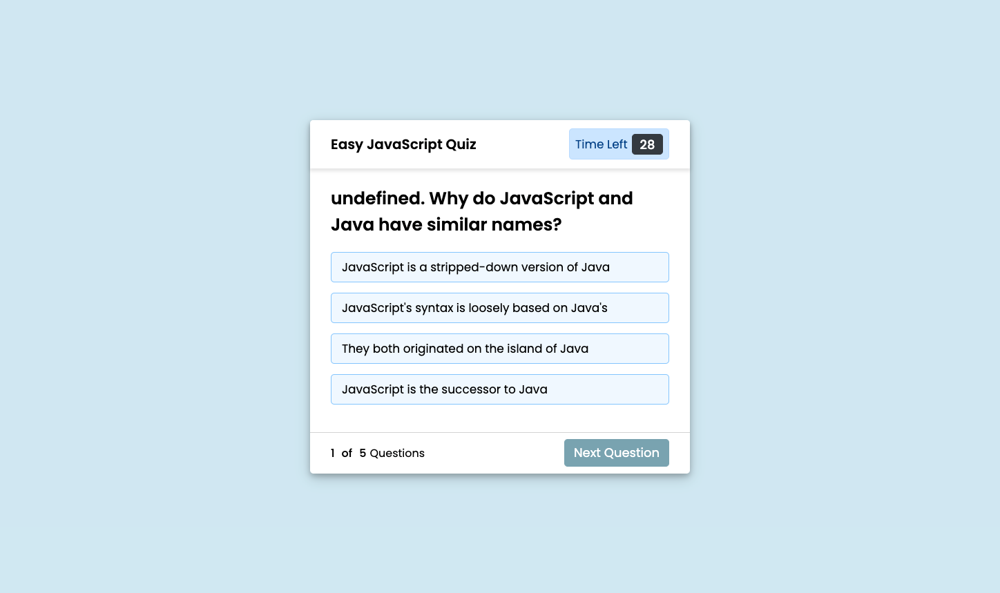
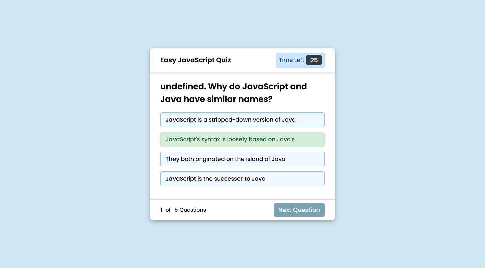

# 04 Web APIs: Code Quiz

## Installation
Link to working site: 

## Repository
Link to repository: 

## Description

This week asked us to create a JavaScript Quiz that asks the user any number amount of questions. 
The quiz is to have a timer and for each incorrect answer the user inputs, a certain number of seconds are removed from the timer. 
At the end of the quiz, the user is asked to enter their name or initials to keep on a "high score" board. 
The score being the number of seconds left on the clock at the end of the quiz. 

## User Story

```
AS A coding boot camp student
I WANT to take a timed quiz on JavaScript fundamentals that stores high scores
SO THAT I can gauge my progress compared to my peers
```

## Acceptance Criteria

```
GIVEN I am taking a code quiz
WHEN I click the start button
THEN a timer starts and I am presented with a question
WHEN I answer a question
THEN I am presented with another question
WHEN I answer a question incorrectly
THEN time is subtracted from the clock
WHEN all questions are answered or the timer reaches 0
THEN the game is over
WHEN the game is over
THEN I can save my initials and my score
```

## Result
Final screenshot of the quiz:

